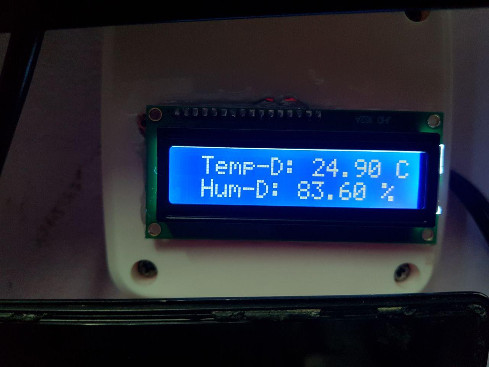
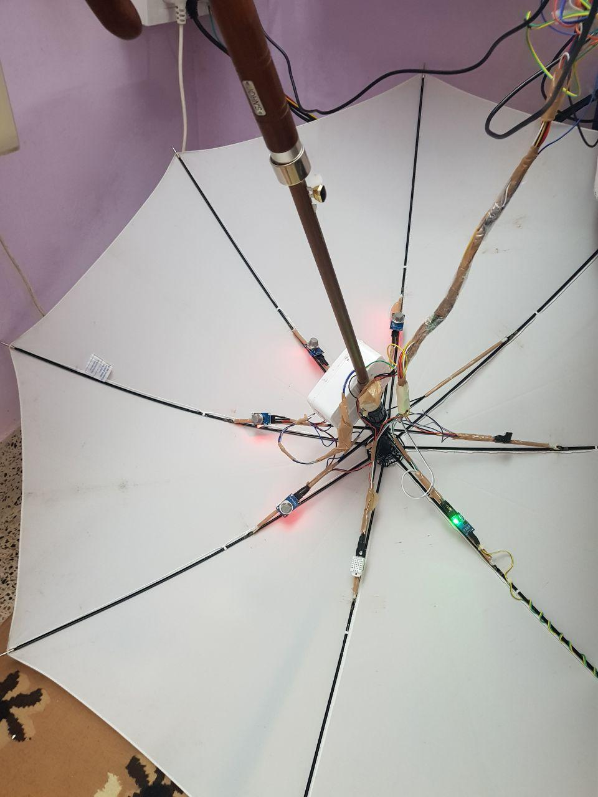
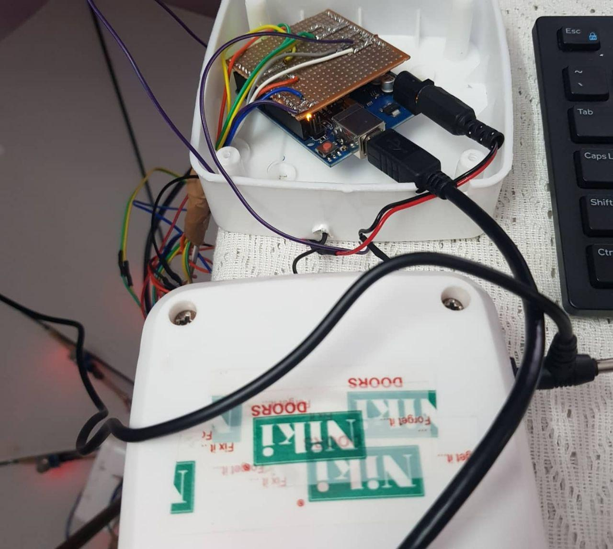
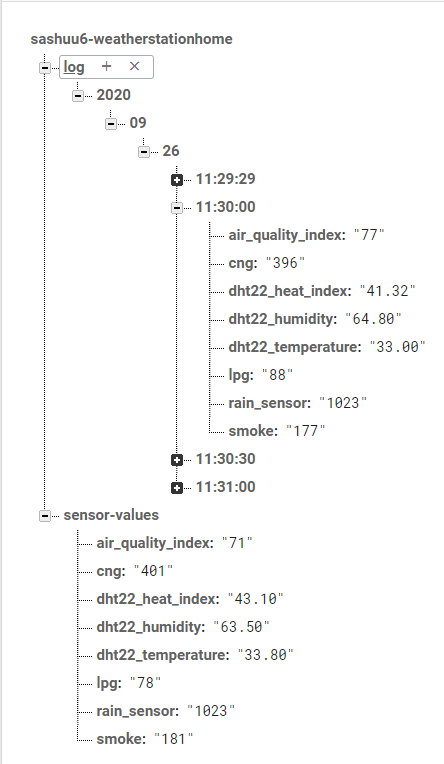

# Home Weather Station

## Introduction

The home Weather Station is a DYI weather Station that collects the following data and uploads the data to firebase:-

1. Air Quality Index
2. Compressed Natural Gas (CNG)
3. Liquid Petroleum Gas (LPG)
4. Smoke
5. Rain
6. Temperature
7. Humidity
8. Heat Index

 

## Features

1. Collects AQI, CNG, LPG, smoke, temperature, humidty, rain presence and heat index.
2. Stores the data in a log file and Firebase.
3. Aa LCD display to show the current latest values from the sensors.

## Components USed

1. Arduino Nano - [Tomson Electronics](https://www.tomsonelectronics.com/products/buy-arduino-nano-v3-0-online-india)
2. Arduino UNO and programming cable - [Tomson Electronics](https://www.tomsonelectronics.com/products/arduino-bundle-1)
3. MQ-2 gas sensor - [Tomson Electronics](https://www.tomsonelectronics.com/products/mq-2-mq2-smoke-gas)
4. MQ-4 - [Amazon](https://www.amazon.in/REES52-Natural-Methane-Sensor-Arduino/dp/B01L0FIH94)
5. MQ-5 - [Tomson Electronics](https://www.tomsonelectronics.com/products/smoke-gas-detector-sensor-module)
6. MQ-135 - [Tomson Electronics](https://www.tomsonelectronics.com/products/air-quality-control-gas-sensor-mq-135)
7. Rain sensor - [Tomson Electronics](https://www.tomsonelectronics.com/products/rain-drop-detection-sensor-rain-detector-weather-module)
8. DHT22 - [Tomson Electronics](https://www.tomsonelectronics.com/products/dht22-digital-temperature-and-humidity-sensor-module-am2302)
9. Raspberry Pi Zero W - [Tomson Electronics](https://www.tomsonelectronics.com/products/buy-raspberry-pi-zero-w-online-india)
10. LCD module - [Tomson Electronics](https://www.tomsonelectronics.com/products/16x2-jhd-lcd-display)
11. LCD I2C module - [Tomson Electronics](https://www.tomsonelectronics.com/products/iic-i2c-serial-interface-adapter-module-for-display)
12. SD card class 10 16 GB - [Amazon](https://www.amazon.in/HP-MicroSD-U1-TF-Card-16GB/dp/B07DJGJ2H1/ref=sr_1_4?dchild=1&keywords=memory+cards+class+10+16gb&qid=1601314962&sr=8-4)
13. 220V to 12V DC Adapter - [Amazon](https://www.amazon.in/TRP-TRADERS-CAMCALL-Power-Adapter/dp/B01FTYAUCY)
14. Buck converter - [Tomson Electronics](https://www.tomsonelectronics.com/products/lm-2596-dc-dc-buck-converter)
15. Male headers - [Tomson Electronics](https://www.tomsonelectronics.com/products/40x2-male-berg-strip-straight)
16. Female headers - [Tomson Electronics](https://www.tomsonelectronics.com/products/40x2-female-berg-strip-straight)
17. Dotted PCB - [Robo Elements](https://www.roboelements.com/product/general-purpose-zero-pcb-printed-circuit-board-4x6-inches/)
18. Ribbon cable - [Amazon](https://www.amazon.in/Ribbon-Cable-10-wire-15ft/dp/B007R9SQQM)
19. USB extension cable - [Amazon](https://www.amazon.com/Monoprice-Extension-Repeater-PlayStation-Keyboard/dp/B004PLLA9U?th=1)

Discount code for Tomson Electronics : ZENOOFF2020

## Images

 

## Sensor Info

Sensor Name  | Features
------------ | -------------
MQ-2 | Smoke
MQ-4 | CNG
MQ-5 | LPG
MQ-135 | AQI
Rain sensor | Rain
DHT22 | Temperature, Humidity and Heat Index

## Database

## TO-DO

1. Convert analog values from gas sensors to PPM (Parts Per Million).
2. Final gas sensor calibration.
3. Web Application in python flask to show the generatd values.
4. pyQT application for basic monitoring.
